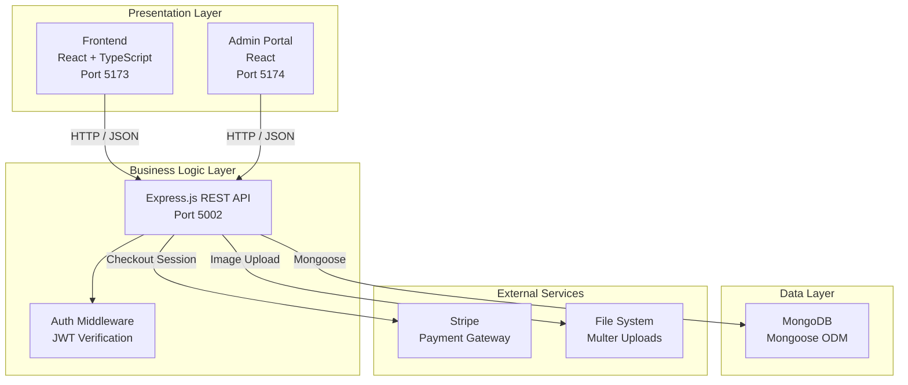
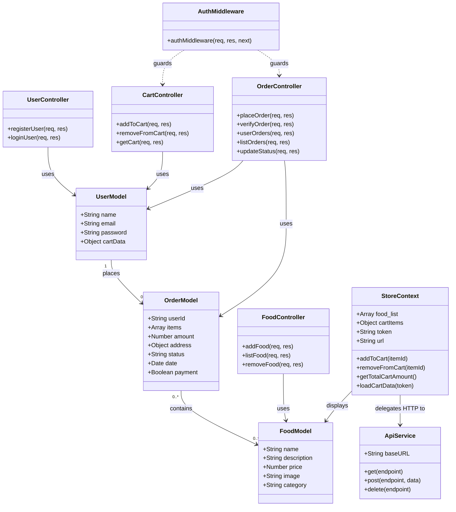
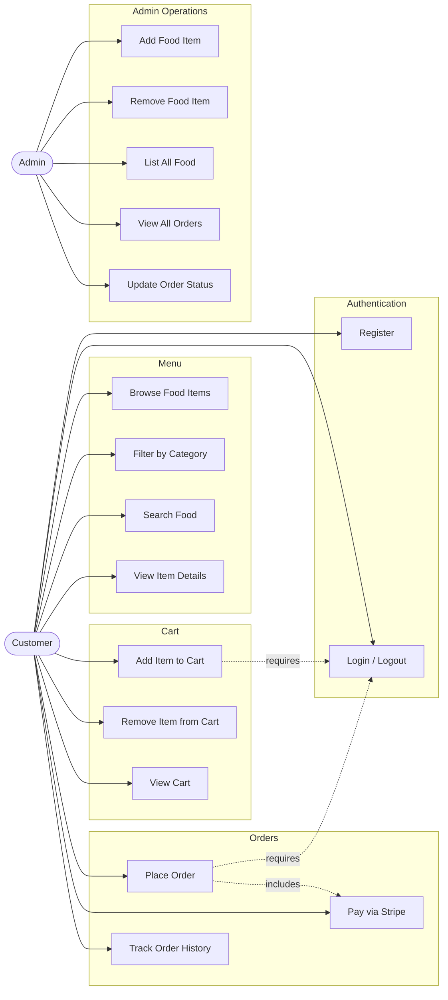
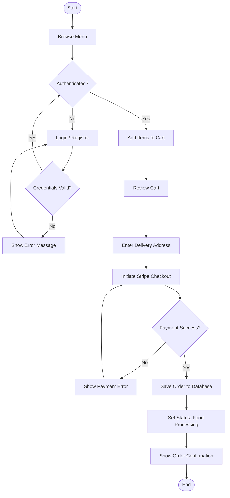
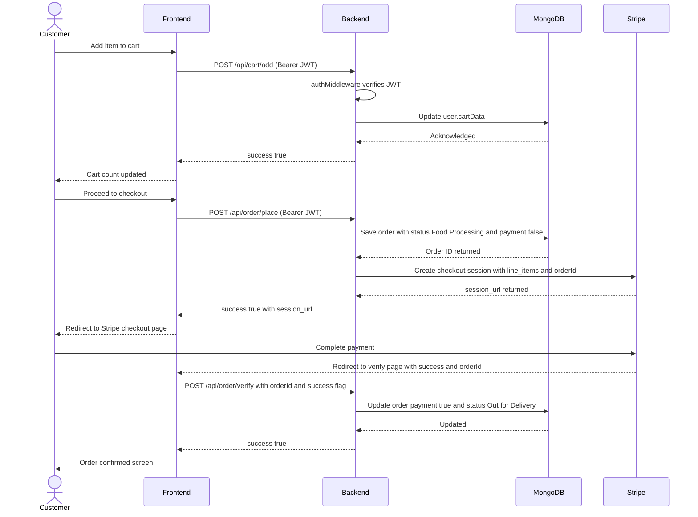
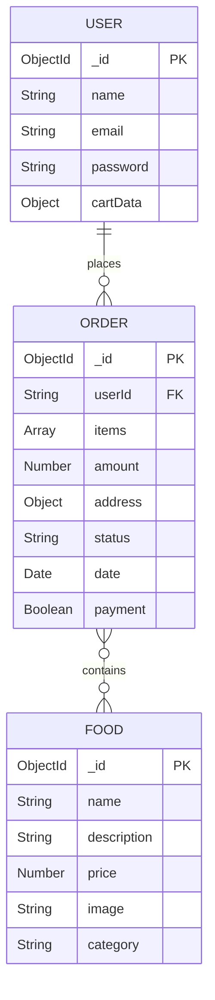

# Tomato — Food Delivery Platform

Full-stack food ordering application built with React, Node.js, and MongoDB. Supports menu browsing, cart management, Stripe payments, and an admin portal for restaurant management.

**Live:** [tomato-ts-9jwz.vercel.app](https://tomato-ts-9jwz.vercel.app/)
Project Report : https://docs.google.com/document/d/1PM0NlE8mo6EErPoa8tInHh38CQy28wb3zNlhKItyexo/edit?usp=sharing
---

## Table of Contents

- [Tech Stack](#tech-stack)
- [Project Structure](#project-structure)
- [System Architecture](#system-architecture)
- [UML Diagrams](#uml-diagrams)
- [OOP Concepts](#oop-concepts)
- [Design Patterns](#design-patterns)
- [SOLID Principles](#solid-principles)
- [Setup and Installation](#setup-and-installation)
- [Development Workflow](#development-workflow)
- [Deployment](#deployment)
- [Team](#team)

---

## Tech Stack

| Layer | Technology | Version |
|---|---|---|
| Frontend UI | React | 18.2.0 |
| Type Safety | TypeScript | 5.x |
| Build Tool | Vite | 5.0.8 |
| Routing | React Router DOM | 6.22.0 |
| HTTP Client | Axios | 1.6.7 |
| Notifications | React Toastify | 10.0.4 |
| Runtime | Node.js | 18+ |
| API Framework | Express.js | 4.18.2 |
| Database | MongoDB | 8.1.1 |
| ODM | Mongoose | latest |
| Authentication | JWT (jsonwebtoken) | 9.0.2 |
| Password Hashing | bcrypt | 5.1.1 |
| Payment Gateway | Stripe | 14.17.0 |
| File Upload | Multer | 1.4.5 |
| Input Validation | validator | 13.11.0 |
| Dev Server | Nodemon | 3.0.3 |
| Env Management | dotenv | 16.4.1 |
| Linting | ESLint | latest |

---

## Project Structure

```
Tomato-ts/
├── backend/
│   ├── config/
│   │   └── db.js                  # MongoDB connection
│   ├── controllers/
│   │   ├── foodController.js
│   │   ├── userController.js
│   │   ├── cartController.js
│   │   └── orderController.js
│   ├── middleware/
│   │   └── auth.js                # JWT verification middleware
│   ├── models/
│   │   ├── foodModel.js
│   │   ├── userModel.js
│   │   └── orderModel.js
│   ├── routes/
│   │   ├── foodRoute.js
│   │   ├── userRoute.js
│   │   ├── cartRoute.js
│   │   └── orderRoute.js
│   └── server.js
├── frontend/
│   └── src/
│       ├── components/            # Reusable UI components
│       ├── pages/                 # Route-level page components
│       ├── Context/
│       │   └── StoreContext.jsx   # Global state provider
│       ├── services/              # API abstraction layer
│       ├── patterns/              # Observer, ServiceFactory
│       └── models/
│           └── types.ts           # TypeScript type definitions
├── admin/
│   └── src/
│       ├── components/
│       └── pages/
│           ├── Add/               # Add food items
│           ├── List/              # List all food
│           └── Orders/            # Manage orders
└── vercel.json
```

---

## System Architecture

> **Three-tier architecture** — presentation, business logic, and data are separated into distinct layers with clear contracts between them.



**Glossary**
- **REST API** — Stateless interface where each HTTP request contains all information needed to process it.
- **ODM (Object-Document Mapper)** — Maps JavaScript objects to MongoDB documents; Mongoose is the ODM used here.
- **JWT (JSON Web Token)** — Compact, URL-safe token used for stateless authentication between client and server.
- **Middleware** — Function in the request pipeline that intercepts and processes requests before they reach the route handler.

---

## UML Diagrams

### Class Diagram

> Represents the static structure of the system — classes, their attributes, methods, and relationships.



**Glossary**
- **Controller** — Handles incoming HTTP requests and delegates to models; keeps route handlers thin.
- **Model** — Mongoose schema that defines the shape of a MongoDB document and enforces data validation.
- **Composition (`-->`)** — One class holds a reference to another and uses its behavior.
- **Dependency (`..>`)** — One class depends on another without owning it (e.g., middleware guards a controller).

---

### Use Case Diagram

> Shows what actors can do in the system — captures functional requirements without implementation detail.



**Glossary**
- **Actor** — External entity (user or system) that interacts with the application.
- **Use Case** — A discrete piece of functionality the system provides to an actor.
- **Requires (`-.->`)** — The use case cannot be performed without the dependent one being satisfied first.
- **Includes** — A use case always invokes another as part of its execution.

---

### Activity Diagram

> Models the workflow of a process as a sequence of actions with decision points and forks.



**Glossary**
- **Decision Node (diamond)** — A branch point where the flow splits based on a condition.
- **Activity** — A single step or action in the workflow.
- **Start/End Nodes** — Represent entry and exit points of the process flow.

---

### Sequence Diagram — Order Placement

> Shows the time-ordered interaction between objects for a specific scenario.



**Glossary**
- **Participant** — An entity involved in the interaction (actor, service, or system component).
- **Synchronous call (`->>`)** — Caller waits for the response before continuing.
- **Return message (`-->>`)** — Response sent back from callee to caller.
- **Bearer JWT** — Authentication scheme where the JWT token is passed in the `Authorization` HTTP header.
- **Stripe Checkout Session** — A Stripe-hosted payment page created server-side; client is redirected to it.

---

### ER Diagram

> Defines the data model — entities, their attributes, and how they relate to each other in the database.



**Glossary**
- **PK (Primary Key)** — Unique identifier for each document; MongoDB uses `ObjectId` by default.
- **FK (Foreign Key)** — Reference to a document in another collection; here `userId` links an order to a user.
- **One-to-Many (`||--o{`)** — One user can place many orders; each order belongs to one user.
- **Many-to-Many (`}o--o{`)** — An order can contain many food items; a food item can appear in many orders.
- **cartData** — Embedded object on `USER` storing `{ foodId: quantity }` pairs for cart persistence.

---

## OOP Concepts

### Encapsulation
Mongoose schemas in `backend/models/` hide internal data structure. External code interacts only through defined schema fields and controller methods — direct DB access is not exposed to routes.

### Abstraction
`frontend/src/services/` (ApiService, AuthService, CartService, FoodService, OrderService) abstract all HTTP communication. Components call `CartService.addItem()` without knowing Axios or endpoint details.

### Inheritance
All React components inherit the React component lifecycle. Custom hooks in the frontend compose shared behavior (data fetching, state updates) that multiple components inherit through the hook pattern.

### Polymorphism
`StoreContext.addToCart(itemId)` behaves differently based on whether the item already exists in the cart — it initializes a new entry or increments an existing one, both through the same method signature.

---

## Design Patterns

### Observer Pattern
`frontend/src/patterns/Observer.ts` — React Context acts as a subject; all subscribed components re-render when `StoreContext` state changes. Cart badge in Navbar and cart page both react to the same `cartItems` state update without direct coupling.

### Factory Pattern
`frontend/src/patterns/ServiceFactory.ts` — Centralizes creation of service instances (ApiService, AuthService, etc.), decoupling components from concrete service constructors.

### Repository Pattern
`backend/models/` act as repositories. Controllers interact with the database exclusively through Mongoose model methods (`find`, `save`, `findByIdAndDelete`), not raw queries.

### Singleton Pattern
`StoreContext` provider wraps the entire React tree exactly once — a single source of truth for `food_list`, `cartItems`, and `token` shared across all components.

---

## SOLID Principles

**Single Responsibility** — Each controller file owns exactly one domain: `foodController` handles food CRUD, `userController` handles authentication, `orderController` handles order lifecycle.

**Open/Closed** — React components accept props to change behavior without modifying component internals. New food categories or order statuses require no changes to existing components.

**Liskov Substitution** — All service classes (`FoodService`, `CartService`, `OrderService`) follow the same interface contract from `ApiService`, making them interchangeable where the base interface is expected.

**Interface Segregation** — Routes are split into `/api/food`, `/api/user`, `/api/cart`, `/api/order`. Clients consume only the endpoints relevant to them; no bloated catch-all routes.

**Dependency Inversion** — Database URI, JWT secret, and Stripe key are injected via environment variables at runtime. High-level modules (controllers) depend on abstractions (env config), not hardcoded values.

---

## Setup and Installation

### Prerequisites

- Node.js 18+
- MongoDB 5.0+ (local or Atlas)
- npm 8+
- Stripe account (test keys sufficient)

### Clone

```bash
git clone https://github.com/SayAn1-dls/Tomato-ts.git
cd Tomato-ts
```

### Backend

```bash
cd backend
npm install
cp .env.example .env   # then edit .env
```

`.env` required keys:

```env
MONGODB_URI=mongodb://localhost:27017/tomato
JWT_SECRET=your_jwt_secret
STRIPE_SECRET_KEY=sk_test_...
```

### Frontend

```bash
cd ../frontend
npm install
cp .env.example .env
```

`.env` required key:

```env
VITE_API_URL=http://localhost:5002
```

### Admin Portal

```bash
cd ../admin
npm install
```

---

## Development Workflow

### 1. Start All Services

**Terminal 1 — Backend**
```bash
cd backend
npm run server
# Runs on http://localhost:5002
```

**Terminal 2 — Frontend**
```bash
cd frontend
npm run dev
# Runs on http://localhost:5173
```

**Terminal 3 — Admin Portal**
```bash
cd admin
npm run dev
# Runs on http://localhost:5174
```

### 2. Code Quality

- **ESLint** enforces consistent style; run `npm run lint` in frontend or admin.
- **TypeScript** type-checks components and services; run `tsc --noEmit`.
- **Nodemon** auto-restarts the backend on file changes during development.

### 3. Branch Strategy

```
main          — production-ready
feature/*     — new features, merged via PR
fix/*         — bug fixes
```

Commit format: `type(scope): description` — e.g. `feat(cart): add quantity selector to modal`.

### 4. Production Build

```bash
# Frontend
cd frontend && npm run build

# Admin
cd admin && npm run build
```

---

## Deployment

Deployed on Vercel using `vercel.json` at the repo root.

| App | URL |
|---|---|
| Frontend | [tomato-ts-9jwz.vercel.app](https://tomato-ts-9jwz.vercel.app/) |
| Backend | Vercel serverless (configure separately) |

Environment variables must be set in the Vercel dashboard for both frontend and backend projects.

---

## Team

| Name | Role | Contribution |
|---|---|---|
| Sayan Bhattacharya | Lead Developer & Architect | Full-stack implementation, JWT auth, Stripe integration, DB schema, admin dashboard |
| Debasish Karn | Project Architect | System architecture planning, scalable project structure, backend design decisions |
| Saswataduity Bhuin | UI/UX Designer | Interface design, layouts, visual elements, interaction flow |
| Rishav Dewan | Tester & Debugger | Feature testing, bug identification and resolution, stability verification |
| Siddhant Giri | Project Manager | Team coordination, task assignment, milestone tracking |

---

## License

MIT License. See [LICENSE](LICENSE) for details.
